# Project Description
### IS 601850 - Web Application - Part 3
This project is a homework assignment to teach how to get Pycharm setup with Docker, Flask, MySQL, and Postman

## A. Data Tables in Pycharm
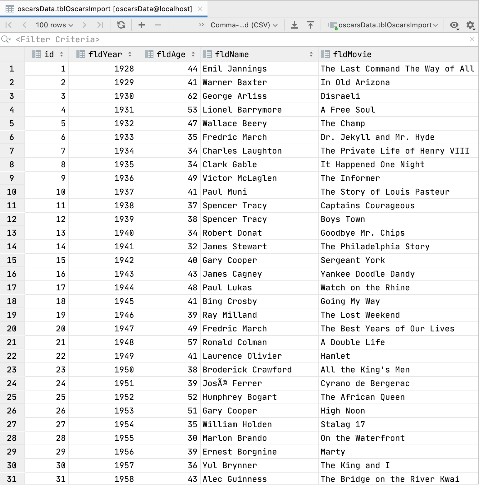

## B. Browser Homepage Data
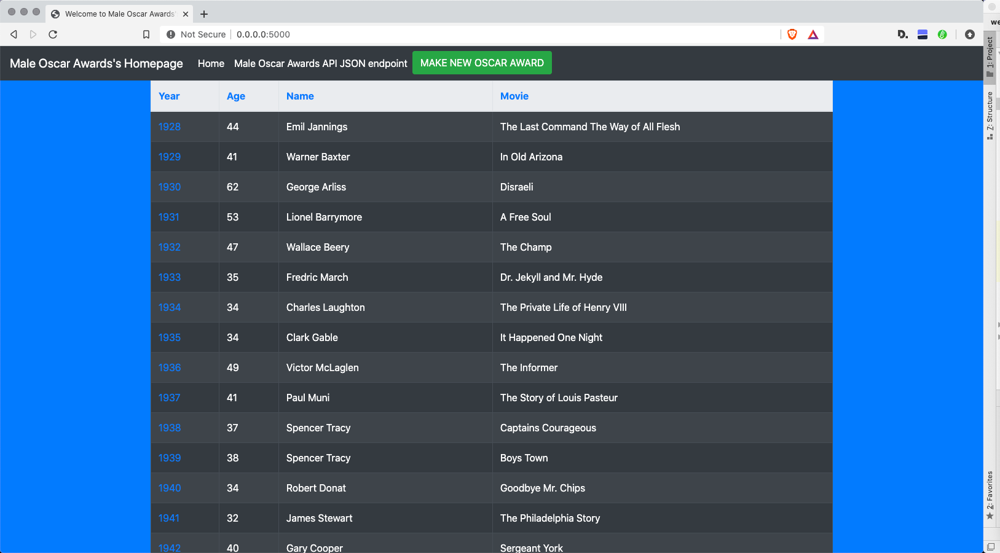

## C. View of One Record
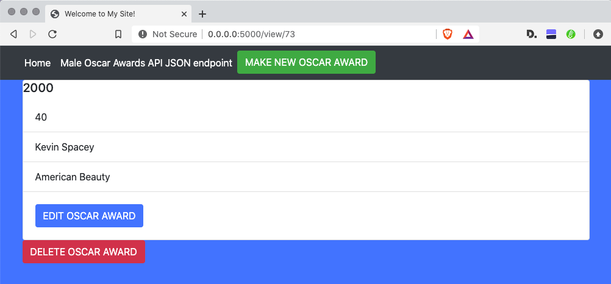

## D. Add New Record
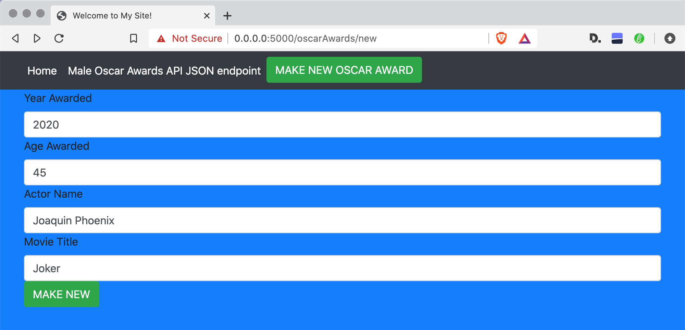

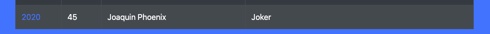

## E. Updated Record
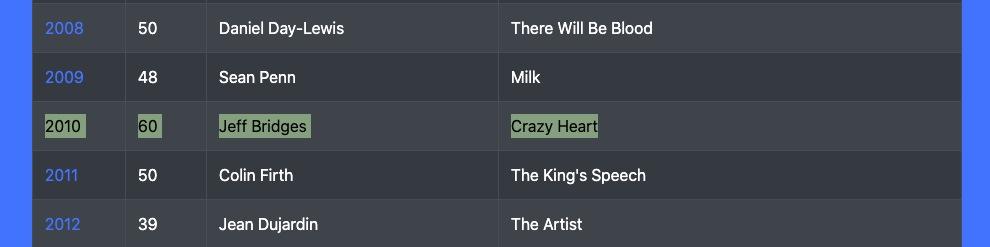

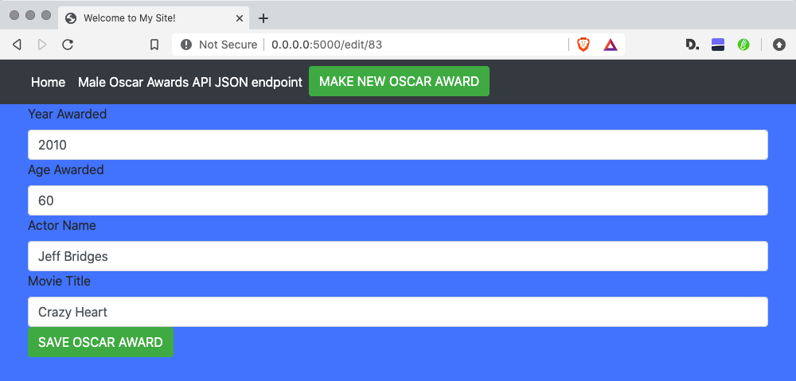

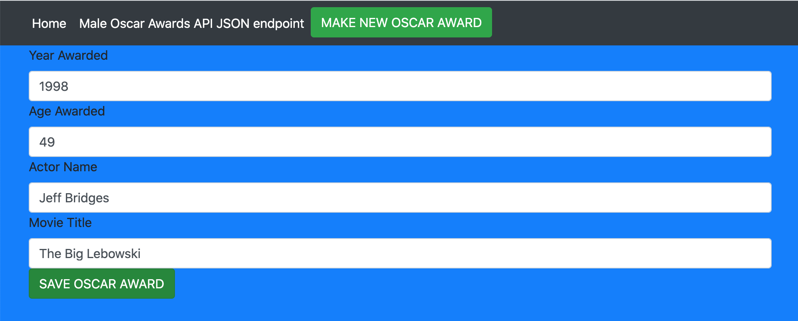

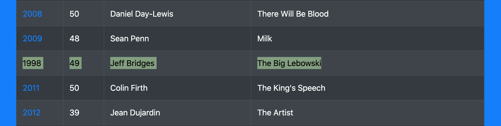

## F. Deleted Record

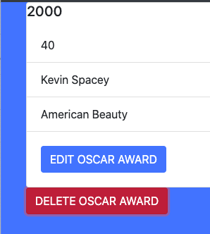

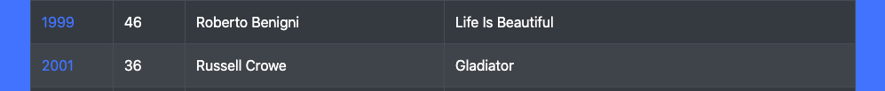