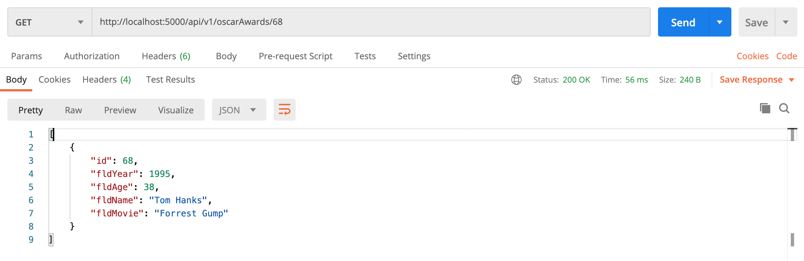
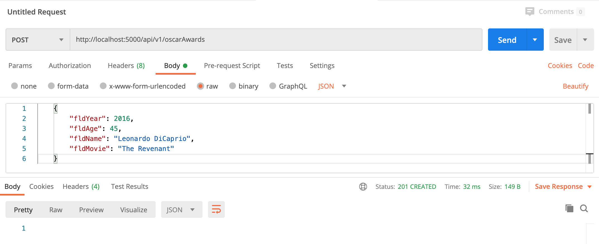
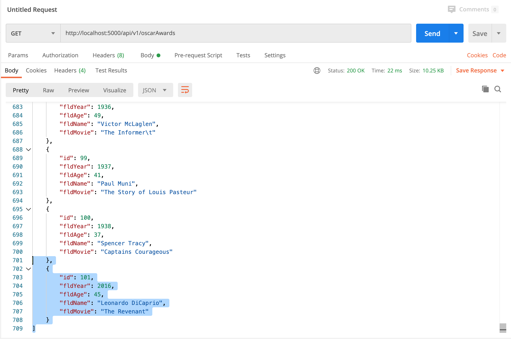
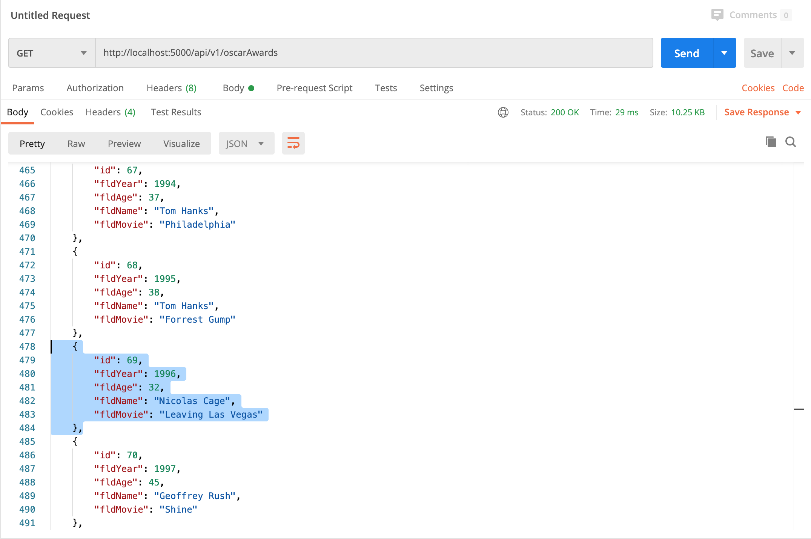
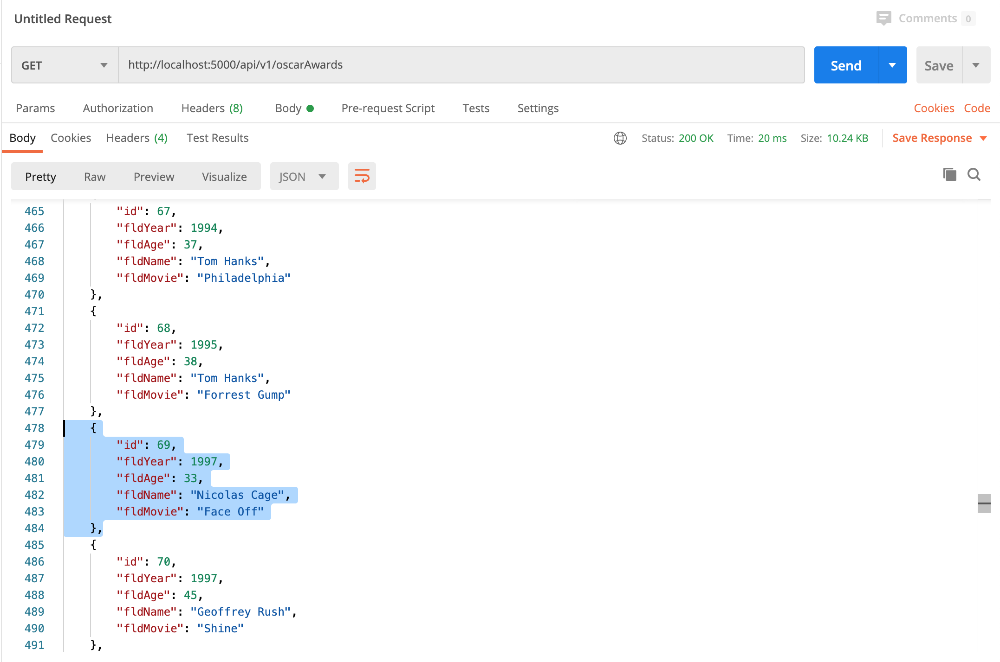
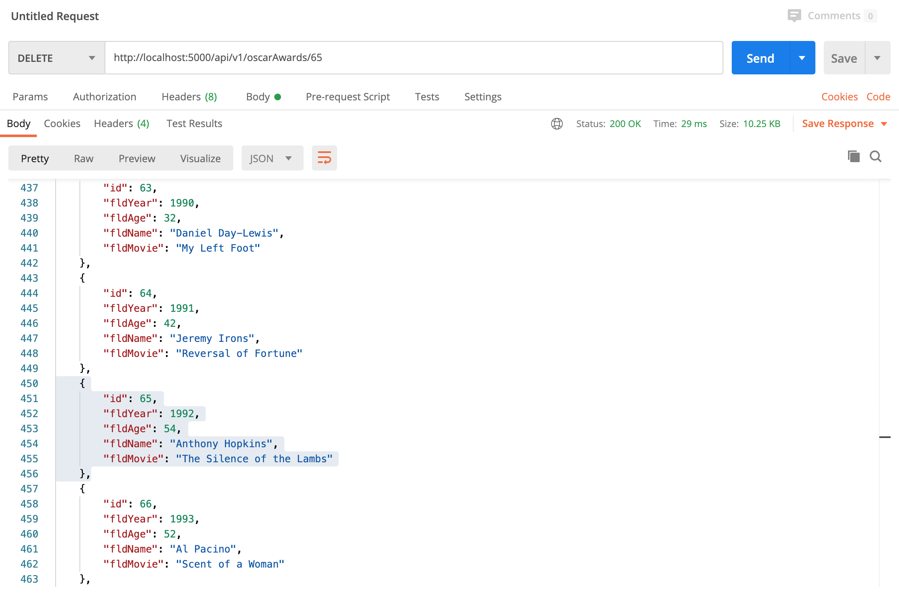
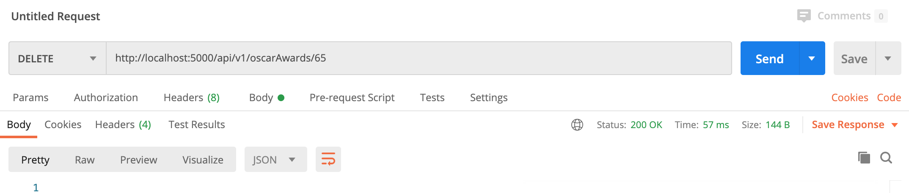
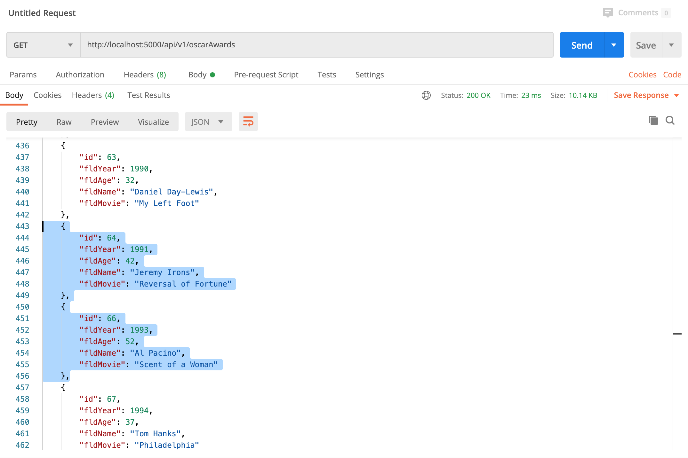

# Project Description
### IS 601850 - Web Application - Part 4
This project is a homework assignment to teach how to get Pycharm setup with Docker, Flask, MySQL, and Postman

## A. Data Tables in Postman

## B. View of One Record in Postman

## C. Add New Record in Postman

## D. Updated Record in Postman

## E. Deleted Record in Postman

